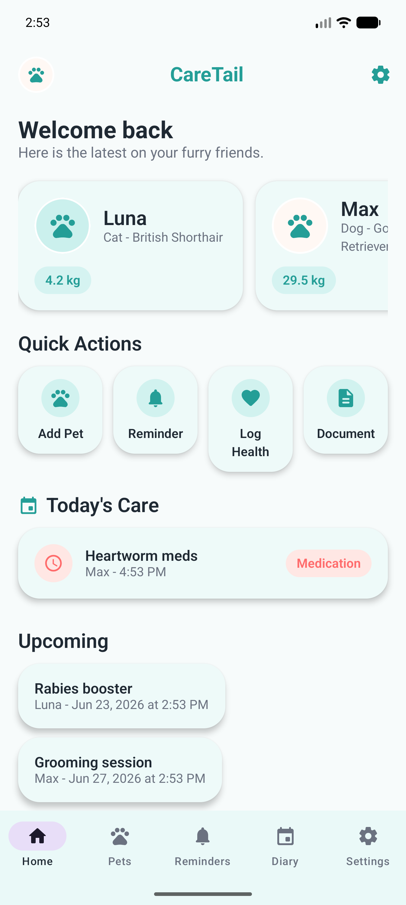
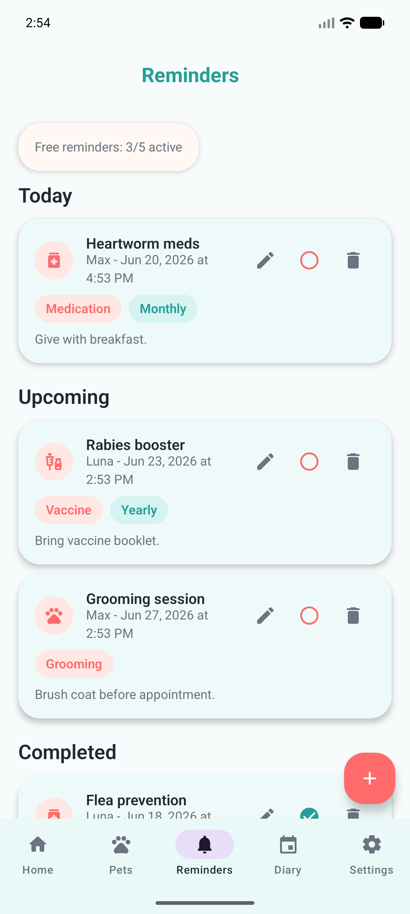
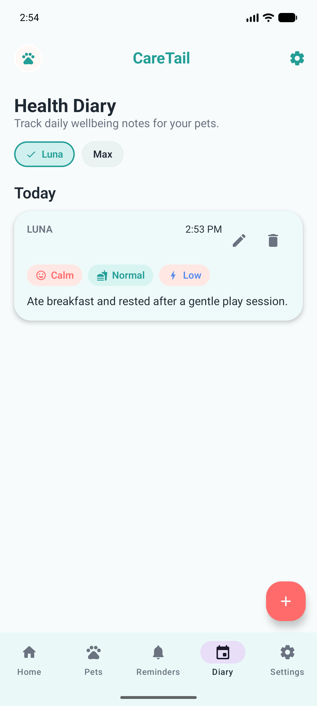

# CareTail

**A local-first Android pet-care tracker for keeping a pet's profile, care reminders, health notes, documents, and care history together.**

CareTail is built for cat and dog owners who want a calmer way to organise recurring care and pet records without depending on a cloud account for the core workflow. The active Android application is the `app/` module in this repository.

## Product overview

Pet-care information often ends up split between memory, calendars, paper records, and phone notes. CareTail brings the day-to-day record together on the device: create a pet profile, add care reminders, record health diary notes, attach document references, and review the pet's history before a vet visit.

The product is designed for individual pet owners, including multi-pet households. It is a care-organisation tool, not veterinary advice, diagnosis, or treatment.

## Screenshots

These are real application screenshots stored in the repository.

<p align="center">
  
  
  
</p>

## Implemented product capabilities

- Onboarding and local pet profiles, including multi-pet management.
- A dashboard for current and upcoming care.
- Create, edit, complete, and delete care reminders; schedule local Android notifications when permission is granted.
- Health diary entries for a pet's day-to-day care history.
- Document records backed by Android document-picker URIs.
- Premium limits and upgrade UI, with Google Play Billing client integration and purchase restoration logic.
- Premium-gated pet health report export.
- Optional Google sign-in and account-deletion flow.
- Firebase Analytics event tracking designed around product actions rather than pet-record content.
- Google Play in-app review eligibility logic.

## Architecture

CareTail is a native Android application built with Kotlin and Jetpack Compose. UI screens use Compose Navigation and screen-specific view models. An application-level container assembles repositories and platform services. Repositories persist pets, reminders, diary entries, and document metadata through Room DAOs into an on-device database. Android system APIs handle notifications, document selection, sharing/export, and the in-app review flow.

Supporting integrations are deliberately separated from the core local data model: Firebase supports optional authentication and analytics, while Google Play Billing supplies subscription product and entitlement state. A small Remotion/React workspace at the repository root is used to render product-video assets; it is not part of the Android runtime.

## Main product flow

1. A new user completes onboarding and creates a pet profile.
2. They add a care reminder, diary entry, or document record for that pet.
3. The dashboard and profile surface upcoming care and recent history.
4. When a reminder is due, CareTail can show a local notification if the user has enabled and granted notification permission.
5. Free-plan limits route eligible actions to the Premium screen; live purchases require Play Console product configuration and track-based testing.

## Tech stack

- Kotlin, Java 17, Gradle, Android SDK 35
- Jetpack Compose and Material 3
- Navigation Compose and lifecycle view models
- Room and DataStore for local persistence and preferences
- Kotlin coroutines
- Firebase Authentication and Firebase Analytics
- Google Identity/Credential Manager
- Google Play Billing and In-App Review
- JUnit 4 unit tests
- React, TypeScript, and Remotion for repository-local product-video rendering

## Product status

The codebase contains an implemented, locally persisted Android MVP with release-signing and closed-testing documentation. It should be treated as **pre-production / testing-ready**, not as evidence of a public launch: no verified public website or Google Play listing is linked here.

Several integrations require environment and console configuration before a production release, including Firebase OAuth fingerprints/configuration, Google Play subscription products, signing, and device-based notification and billing validation.

## My role

I owned the product end to end: product definition, UX flows, Android architecture, Kotlin/Compose implementation, Room persistence, reminders, document and export workflows, monetisation integration, analytics design, QA documentation, release preparation, and portfolio assets.

AI-assisted development was used transparently as a productivity aid. Product decisions, architecture, integration choices, implementation review, testing, and release ownership remained mine.

## Local setup

### Android app

Prerequisites: Android Studio with an Android SDK available, plus JDK 17.

1. Clone the repository and open it in Android Studio.
2. Create or update the untracked `local.properties` file with your Android SDK path.
3. For Firebase-enabled builds, place a project-specific `google-services.json` at `app/google-services.json`. The file is intentionally ignored and must never be committed.
4. Run the debug build:

   ```powershell
   .\gradlew.bat :app:assembleDebug
   ```

5. To create a signed release bundle, configure the ignored `keystore.properties` and signing key described in [docs/RELEASE_SIGNING.md](docs/RELEASE_SIGNING.md), then run:

   ```powershell
   .\gradlew.bat :app:bundleRelease
   ```

### Product-video workspace (optional)

The React/Remotion files support local marketing-video rendering only. Install its dependencies and open the composer with:

```powershell
npm install
npm run preview
```

See [README_CARETAIL_VIDEO.md](README_CARETAIL_VIDEO.md) for asset and rendering details.

## Verification and testing

Unit tests cover focused business/UI-state logic for premium plans, authentication state and messaging, and review-prompt eligibility. The Gradle project also supports Android lint and debug/release build tasks.

Useful local commands:

```powershell
.\gradlew.bat :app:testDebugUnitTest
.\gradlew.bat :app:lintDebug
.\gradlew.bat :app:assembleDebug
git diff --check
```

Automated checks do not replace device and Play-distributed testing. In particular, notification permission/timing, document-provider behaviour, real purchase/restore flows, and Firebase OAuth configuration need manual verification in the intended release environment.

## Known limitations

- Core records are local to the device; cloud sync and backup are not implemented.
- Google Play Billing client code is present, but real purchase validation requires configured products, a Play testing track, and licensed tester accounts. Server-side purchase-token verification is not implemented.
- Google sign-in is optional and depends on Firebase/Google OAuth configuration, including the appropriate signing-certificate fingerprints.
- Local reminder recurrence scheduling exists, but the stored Room due date is not advanced after a repeat alarm fires.
- No production deployment, public store listing, or public support/deletion URL has been verified for this repository.

## Privacy and security

CareTail's core pet records are stored in an on-device Room database. Document records store local document references; they are not a cloud document service. Firebase Authentication and Analytics integrations are present in the codebase, so any release must verify its final Firebase configuration, data disclosures, privacy policy, and Google Play Data Safety declaration before publication.

Local configuration, signing files, generated app bundles, environment files, databases, and rendering scratch output are ignored by Git. Do not commit production Firebase configuration, keystores, passwords, or personal test data.

## License and portfolio status

No open-source licence is currently included. Until a licence is added, the repository is **all rights reserved** and is shared as a portfolio/code-review project rather than as reusable open-source software.

## Supporting documentation

- [Product requirements](docs/PRD.md)
- [Database notes](docs/DATABASE.md)
- [Notifications](docs/NOTIFICATIONS.md)
- [Premium and billing](docs/PREMIUM.md)
- [Release signing](docs/RELEASE_SIGNING.md)
- [QA checklist](docs/QA_CHECKLIST.md)
